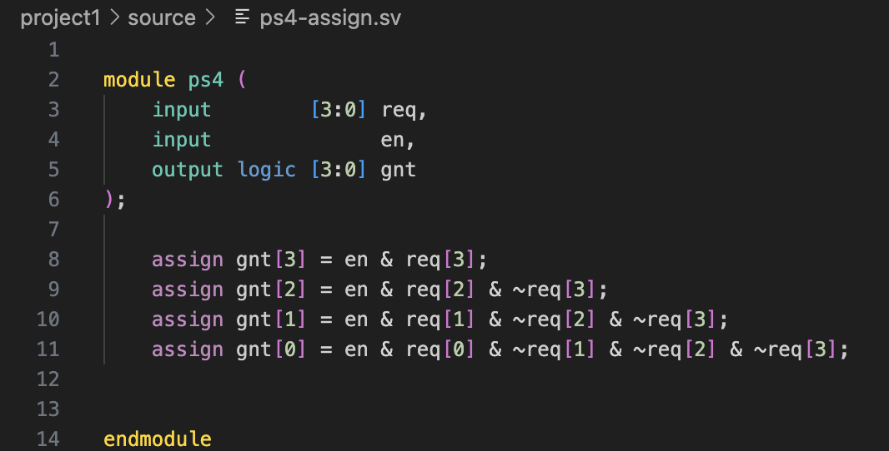
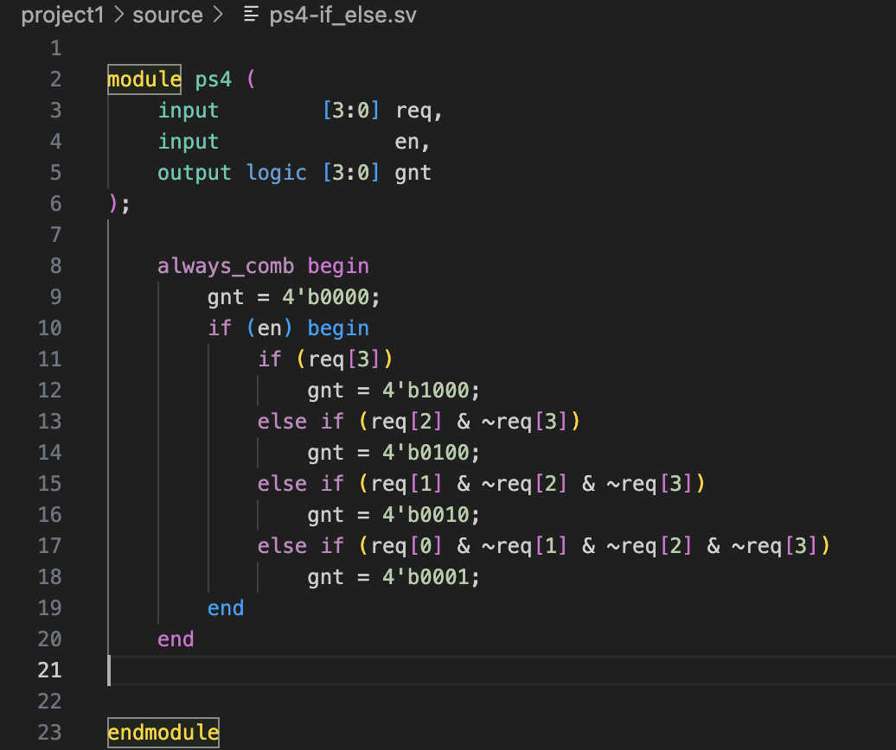

# CSEE4824 Computer Architecture Project1

Zhongheng Cheng (zc2737)

## 4-bit Combinational Priority Selector

### ps4-assign

To use "assign" for constructing ps4, assign every digit of gnt seperately. 

### ps4-if_else

To use "if_else" for constructing ps4, assign every value by conditions inside "always_comb". 

### ps4_testing

