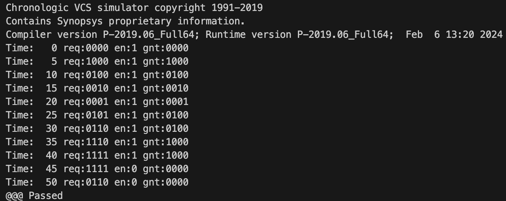

# CSEE4824 Computer Architecture Project1

Zhongheng Cheng (zc2737)

## 4-bit Combinational Priority Selector

### ps4-assign

To use "assign" for constructing ps4, assign every digit of gnt seperately. 

### ps4-if_else

To use "if_else" for constructing ps4, assign every value by conditions inside "always_comb". 

### ps4_testing

The testbench is passed for all cases.

## Hierarchical Priority Selectors

### ps8

To build a ps8, we can build a ps2 firstly.

Then use the ps2 to build a ps4, which is made of two ps2s.

Finally, use the ps4 to build a ps8, similiar to the previous step.

### ps8_testing

I selected some of the cases and wrote testcases for ps8. All the cases are passed.

## Hierarchical Rotating Priority Selectors

### rps4

To build a rps4, build a rps2 first.

Then use three rps2 modules according to the model shown in the instructions.

### rps4_testing

All tests are passed.

